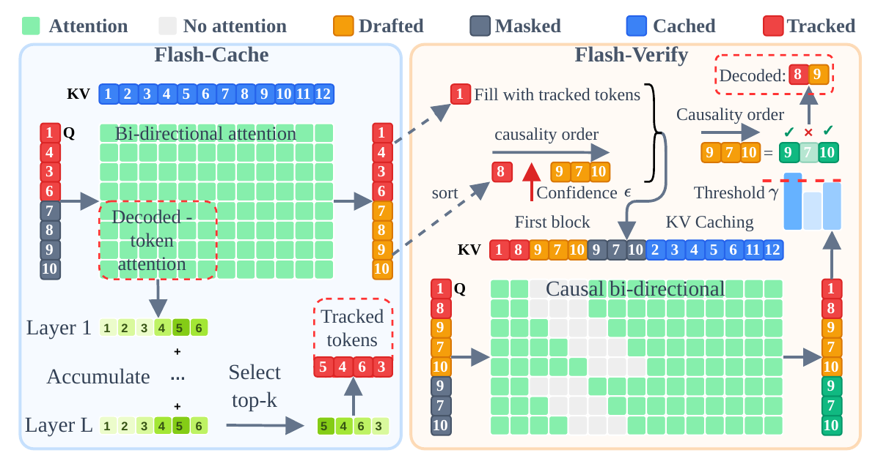
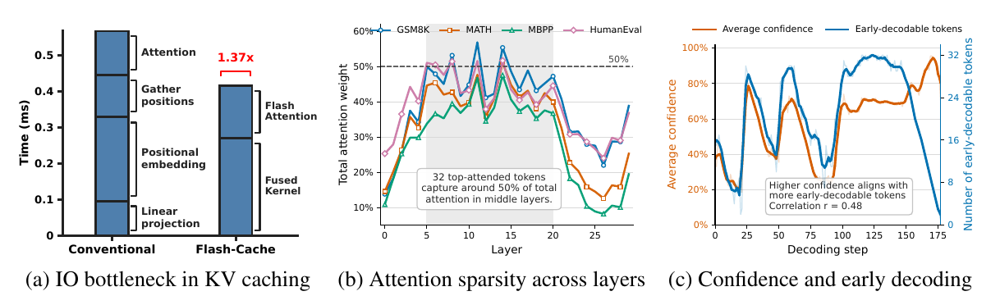
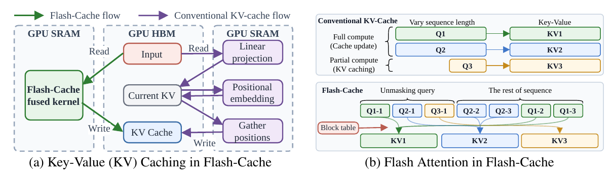
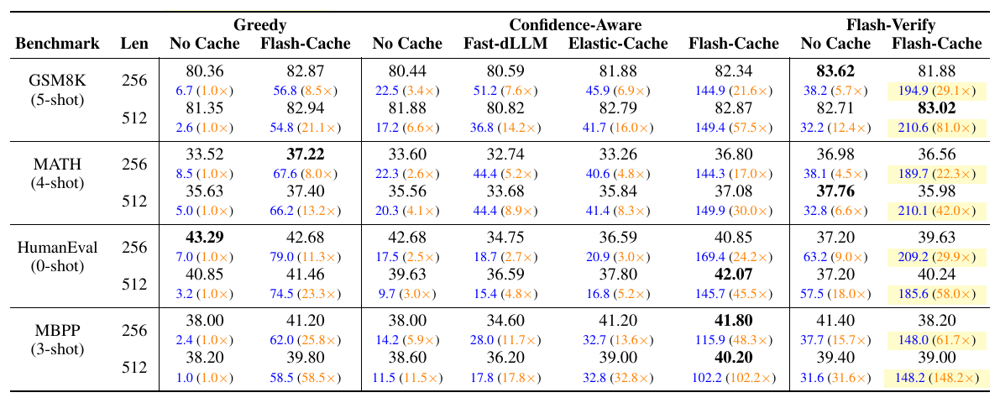
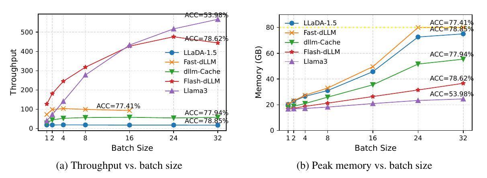
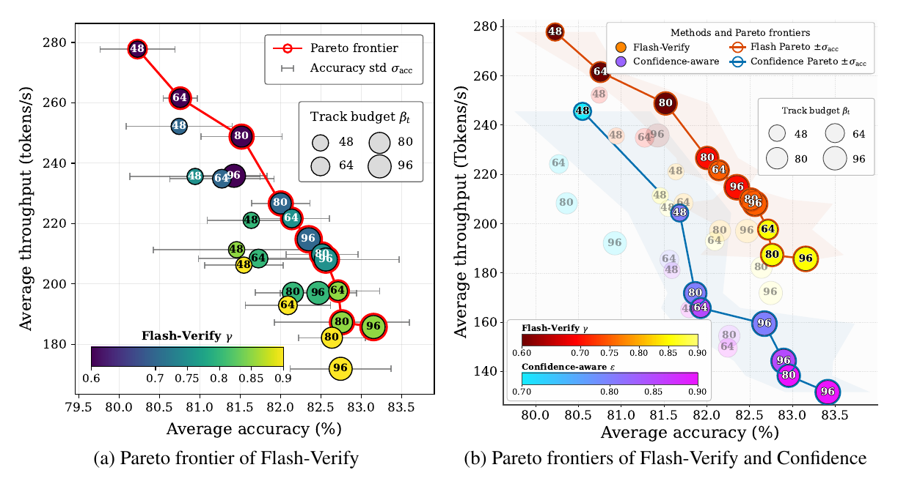

<p align="center">
  
</p>

# Flash-dLLM: IO-Aware KV Caching and Parallel Decoding for Fast, Memory-Efficient Diffusion LLMs


<div align="center">

[Quan Nguyen-Tri](https://scholar.google.com/citations?user=TBcqxpAAAAAJ&hl=en) &nbsp;
[Mukul Ranjan](https://mukul54.github.io/) &nbsp;
[Zhiqiang Shen](https://zhiqiangshen.com/)<sup> * </sup> &nbsp;

VILA Lab, MBZUAI

<sup>*</sup>Corresponding author

[](https://arxiv.org/abs/2609.26796)
[](https://vila-lab.github.io/flash-dllm-webpage/)
[](https://vila-lab.github.io/flash-dllm-webpage/)
[](https://github.com/VILA-Lab/Flash-dLLM/issues)
[](https://github.com/VILA-Lab/Flash-dLLM/stargazers)
[](https://github.com/VILA-Lab/Flash-dLLM/blob/main/LICENSE)

</div>

---

Official implementation of **Flash-dLLM**, a training-free inference acceleration framework for diffusion large language models. Demo videos are on the [project page](https://vila-lab.github.io/flash-dllm-webpage/).

## Contents

- [Overview](#overview)
- [Key results](#key-results)
- [Setup](#setup)
- [Evaluation](#evaluation)
- [Results and logs](#results-and-logs)
- [Citation](#citation)

## Overview

Diffusion large language models generate text through iterative denoising, creating opportunities to decode multiple tokens in parallel. However, repeated KV-cache updates and redundant GPU memory transfers can limit the practical benefits of caching and parallel decoding.

**Flash-dLLM jointly optimizes memory access and token decoding** through two complementary components:

- **Flash-Cache:** I/O-aware KV caching with fused cache-update operations, block-scheduled attention, and selective refresh of influential decoded tokens.
- **Flash-Verify:** KV-cache-driven draft-and-verify decoding in which the diffusion model serves as both drafter and verifier, without an auxiliary model or additional training.

Together, these components reduce cache-management overhead and enable more tokens to be accepted per denoising step, with configurable accuracy-throughput trade-offs.



*Figure 2 from the paper. Flash-Cache and Flash-Verify share the fused kernel and KV cache.*

### Contributions

**I/O-aware KV-cache management.** Flash-Cache fuses QKV projection, rotary positional embedding (RoPE), and cache writes. Intermediate keys and values are not materialized in GPU high-bandwidth memory; the resulting states are written directly to the cache. Scheduled attention uses a block table to handle different query lengths within a batch.

**Attention-guided selective refresh.** Rather than recomputing all decoded positions, Flash-Cache updates newly decoded tokens and a fixed-budget set of influential decoded tokens selected by attention importance. These tracked positions and the current masked window attend to the full KV cache, while other positions are served from cached states.

**Training-free parallel self-verification.** Flash-Verify first accepts predictions above the confidence threshold $\epsilon$. Remaining candidates are ordered by draft confidence and represented twice in the verification query: once as draft tokens and once as `[MASK]` tokens. A causal attention mask prevents a position from accessing its own draft while allowing earlier drafts in the verification order to provide context. In the paper's formulation, a candidate is accepted when the draft and mask-view predictions agree and the mask-view confidence meets $\gamma$; acceptance stops at the first rejection.

<details>
<summary>Motivating observations and kernel design</summary>



*Figure 1 from the paper.* The fused cache pipeline achieves a **1.37× per-layer speedup** in the RTX 3090 microbenchmark. The top-32 most-attended decoded tokens capture approximately 50% of attention in middle layers, motivating selective tracking. Prediction confidence is positively correlated with the number of early-decodable tokens.



*Figure 3 from the paper. I/O-aware memory management in Flash-Cache.* The fused kernel reduces intermediate memory traffic, while block-table scheduling supports full and partial computations with different query lengths.

</details>

## Key results

On **LLaDA-1.5**, Flash-Cache + Flash-Verify achieves the highest throughput among the configurations in **Table 1** across all eight benchmark/length settings:

- **22.3×-148.2× speedup** over greedy decoding without caching, with **148.0-210.6 tokens/s**.
- **5.1× and 11.0× speedups over Elastic-Cache** on GSM8K-512 and HumanEval-512, respectively, based on the Table 1 throughput ratios.
- **23.5%-45.0% higher throughput** than Flash-Cache with confidence-aware decoding across the eight settings.

### Main benchmark results

The following results reproduce the **Flash-Cache + Flash-Verify** column of Table 1. The main benchmark experiments use a **single NVIDIA A100 80GB GPU**; the benchmark-specific settings in Table 3 use **batch size 32**. Length is the requested generation length in tokens. Scores are percentages: GSM8K uses `flexible_extract` exact match, MATH uses `math_verify`, and HumanEval and MBPP use pass@1.

| Benchmark | Length | Score (%) | Throughput (tokens/s) | Speedup vs. greedy, no cache |
| --- | ---: | ---: | ---: | ---: |
| GSM8K (5-shot) | 256 | 81.88 | 194.9 | 29.1× |
| GSM8K (5-shot) | 512 | 83.02 | 210.6 | 81.0× |
| MATH (4-shot) | 256 | 36.56 | 189.7 | 22.3× |
| MATH (4-shot) | 512 | 35.98 | 210.1 | 42.0× |
| HumanEval (0-shot) | 256 | 39.63 | 209.2 | 29.9× |
| HumanEval (0-shot) | 512 | 40.24 | 185.6 | 58.0× |
| MBPP (3-shot) | 256 | 38.20 | 148.0 | 61.7× |
| MBPP (3-shot) | 512 | 39.00 | 148.2 | 148.2× |

**Accuracy depends on the task and decoding configuration.** Flash-Cache + Flash-Verify achieves both the highest accuracy and throughput on GSM8K-512. It is not the most accurate configuration in every setting: for example, confidence-aware Flash-Cache achieves 42.07% on HumanEval-512, compared with 40.24% for Flash-Verify, at lower throughput. Select a configuration according to the required accuracy-throughput balance rather than treating acceleration as universally lossless.

<details>
<summary>Full comparison: greedy, confidence-aware, and Flash-Verify decoding</summary>



*Table 1 from the paper.* Each cell reports accuracy on the first line and throughput with speedup over greedy decoding without caching on the second line. Bold denotes the highest accuracy in a row; yellow shading denotes the highest throughput.

</details>

### Memory efficiency and batch scaling



*Figure 4 from the paper: GSM8K-512, 1-shot prompting, LLaDA-1.5.* Flash-dLLM supports **batch size 32**, whereas Fast-dLLM encounters an out-of-memory limit at batch size 24 in the reported experiment. At batch size 16, Section 3.3 reports approximately **26 GB** of GPU memory for Flash-dLLM versus **50 GB** for Fast-dLLM, a reduction of about **48%**.

This is a **1-shot scalability experiment**, separate from the **5-shot GSM8K results in Table 1**. Llama3-8B is included as an autoregressive reference, not as an accuracy-matched diffusion baseline.

<details>
<summary>Accuracy-throughput trade-offs across tracking budgets and thresholds</summary>



*Figure 5 from the paper. Means and standard deviations are computed over five random seeds.* Tracking budget $\beta_t$ and the verification/confidence thresholds $\gamma$/$\epsilon$ control the operating point. Larger tracking budgets generally improve accuracy at additional computational cost. Flash-Verify offers higher throughput across most of the shared accuracy range, while confidence-aware decoding reaches a slightly higher peak accuracy in this sweep.

</details>

## Setup

Clone the repository and install its dependencies in a virtual environment:

```bash
git clone https://github.com/VILA-Lab/Flash-dLLM.git
cd Flash-dLLM

python -m venv .venv
source .venv/bin/activate
python -m pip install -r requirements.txt

cd llada
```

All evaluation and post-processing commands below are run from **`llada/`**. The reference hardware for the main benchmark results is an NVIDIA A100 80GB GPU; the RTX 3090 measurement above is a separate kernel microbenchmark.

## Evaluation

The evaluator supports two Flash-Cache configurations through `verify` in `--model_args`:

| Configuration | Model argument |
| --- | --- |
| Flash-Cache + confidence-aware decoding | `verify=False` |
| Flash-Cache + Flash-Verify | `verify=True` |

### Benchmark scripts

The scripts cover mathematical reasoning and code generation. Their shared defaults are **batch size `32`**, **generation length `512`**, **block length `16`**, **confidence threshold `0.9`**, and **`mask_num=4`**.

| Command | Harness task | Few-shot examples | `gamma` | `track_num` |
| --- | --- | ---: | ---: | ---: |
| `bash eval_gsm8k.sh` | `gsm8k` | 5 | 0.8 | 4 |
| `bash eval_math.sh` | `minerva_math` | 4 | 0.85 | 4 |
| `bash eval_humaneval.sh` | `humaneval` | 0 | 0.85 | 4 |
| `bash eval_mbpp.sh` | `mbpp` | 3 | 0.8 | 3 |

These settings are assignments near the top of each script, **not command-line options**. Edit the assignments to change the script configuration.

> **Code-execution warning:** HumanEval, MBPP, and HumanEval post-processing execute generated Python. Run code-generation evaluations in an isolated environment.

### Small evaluation

This example evaluates **two GSM8K samples**, using one process and a batch size of one. It still loads the full model. Remove `--limit 2` to evaluate the full task.

```bash
export HF_DATASETS_TRUST_REMOTE_CODE=true

CUDA_VISIBLE_DEVICES=0 accelerate launch --num_processes 1 eval_llada.py \
  --model llada_dist \
  --tasks gsm8k \
  --num_fewshot 5 \
  --batch_size 1 \
  --limit 2 \
  --model_args model_path=GSAI-ML/LLaDA-1.5,gen_length=512,block_length=16,threshold=0.9,gamma=0.8,track_num=4,mask_num=4,verify=False,show_speed=True \
  --output_path evals_results/gsm8k-smoke \
  --log_samples
```

Set **`verify=True`** in `--model_args` to enable Flash-Verify. Use a different `--output_path` for each configuration to keep results separate.

Change `model_path` to select a checkpoint. The scripts also reference `GSAI-ML/LLaDA-8B-Instruct`. The wrapper applies a chat template only when the model path contains `instruct`, case-insensitively; the default `GSAI-ML/LLaDA-1.5` path receives raw task prompts.

<details>
<summary>Device selection and launch behavior</summary>

GSM8K, MATH, and HumanEval set `CUDA_VISIBLE_DEVICES=0` on each launch. MBPP uses the devices visible in the environment and sets `CUDA_LAUNCH_BLOCKING=1` and `PYTORCH_CUDA_ALLOC_CONF=expandable_segments:True`.

Accelerate controls the launch configuration. Use the direct command above to explicitly select a device and one process rather than relying on the shell wrappers or a saved Accelerate configuration.

</details>

### Generation settings

Pass model settings as comma-separated `key=value` pairs in **`--model_args`**. Set the evaluation batch size separately with the harness's **`--batch_size`** option.

| Setting | Role in the current implementation |
| --- | --- |
| `model_path` | Hugging Face model identifier or local checkpoint path. |
| `gen_length` | Requested answer length in tokens. |
| `block_length` | Token block size used during generation. |
| `threshold` | Confidence threshold for accepting predicted tokens. |
| `gamma` | Threshold for accepting draft tokens based on verification probabilities. |
| `track_num` | Number of decoded blocks to refresh, selected by attention scores. A negative value refreshes all positions outside the active block. |
| `mask_num` | Number of masked blocks. |
| `verify` | Enables Flash-Verify when `True`. |

**Adapter details.** Supply numeric `threshold` and `gamma` values when invoking the adapter directly. Their constructor defaults are `None`, but generation expects numbers. For a small evaluation, keep the batch size no larger than the number of requests because generation initializes a full batch from the prompts.

**Paper notation and adapter semantics.** The paper defines $\gamma$ through mask-view confidence and agreement with the draft. The adapter documentation describes `gamma` in terms of cumulative verification probabilities. These descriptions should not be assumed to be interchangeable when interpreting threshold values.

### Matching the paper's experimental settings

The script defaults are not the complete paper configuration. **Table 3** specifies batch size **32**, generation lengths **256 and 512**, a masked-window size of **64 tokens**, and tracking budgets of **64 tokens** for GSM8K, MATH, and HumanEval or **48 tokens** for MBPP. The benchmark-specific `gamma` values are listed in the script table above.

The implementation expresses refresh spans in blocks, while the paper reports token budgets. With `block_length=16`, four blocks represent 64 tokens and three blocks represent 48 tokens. Section 3.1 also gives a general default tracking budget of 80 tokens; use Table 3 for the benchmark-specific presets rather than substituting that general default.

For comparisons with the reported results, match the checkpoint, generation length, few-shot setting, batch size, refresh budgets, decoding mode, and post-processing. A two-sample evaluation checks the execution path; it is not a throughput reproduction. Throughput and memory measurements depend on the experiment configuration.

## Results and logs

The shell scripts redirect standard output to timestamped files under:

```text
logs/<task>_batch<batch_size>_length<length>_block<block_length>/
```

Filenames record decoding settings and the verification mode. **Standard error is not redirected**, so errors and progress output may still appear in the terminal.

Only the HumanEval wrapper explicitly supplies **`--output_path`** and **`--log_samples`**, using its log directory for harness results and samples. For the other tasks, pass those options in a direct command to save structured results and samples, as shown in the small-evaluation example.

### HumanEval post-processing

After running `eval_humaneval.sh`, locate the samples JSONL file under its output directory and pass that specific file to:

```bash
python postprocess_code.py path/to/samples_humaneval.jsonl
```

Replace the example path with the actual samples file. The script extracts and sanitizes generated Python, evaluates each completion with the `code_eval` metric, prints the mean **pass@1**, and writes **`<input-file>.cleaned`** alongside the input. Each output record contains `task_id`, `completion`, and `pass_at_1`.

Run post-processing separately for each verification mode's samples file. This utility expects HumanEval fields such as `doc.prompt`, `doc.entry_point`, `doc.task_id`, `target`, and `resps`; **it is not a general MBPP post-processor**. Run it in an isolated environment because it executes generated code.

## Citation

Please cite the paper when using Flash-dLLM in your research:

```bibtex
@article{nguyentri2026flashdllm,
  title   = {{Flash-dLLM}: IO-Aware KV Caching and Parallel Decoding for Fast, Memory-Efficient Diffusion LLMs},
  author  = {Nguyen-Tri, Quan and Ranjan, Mukul and Shen, Zhiqiang},
  journal = {arXiv preprint arXiv:2609.26796},
  year    = {2026}
}
```

## Acknowledgments

This work is supported by the MBZUAI-WIS Joint Program for Artificial Intelligence Research.

This repository is built upon [LLaDA](https://github.com/ML-GSAI/LLaDA), [Fast-dLLM](https://github.com/NVlabs/Fast-dLLM), [Elastic-Cache](https://github.com/VILA-Lab/Elastic-Cache), and [lm-evaluation-harness](https://github.com/EleutherAI/lm-evaluation-harness).

## License

This project is licensed under the Apache License 2.0. See the [LICENSE](LICENSE) file for details.
